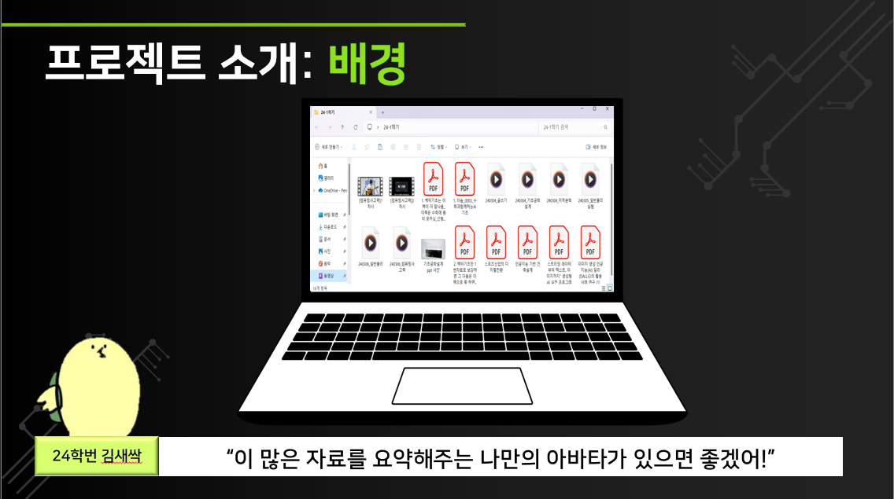
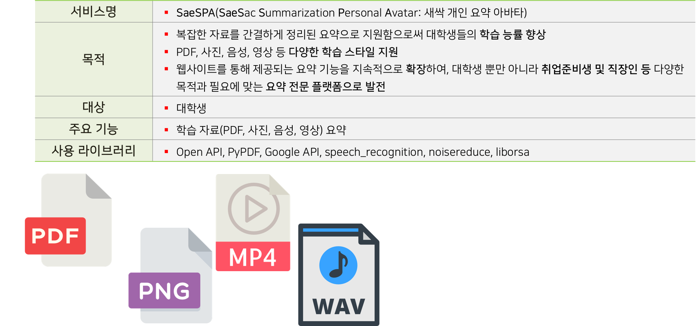
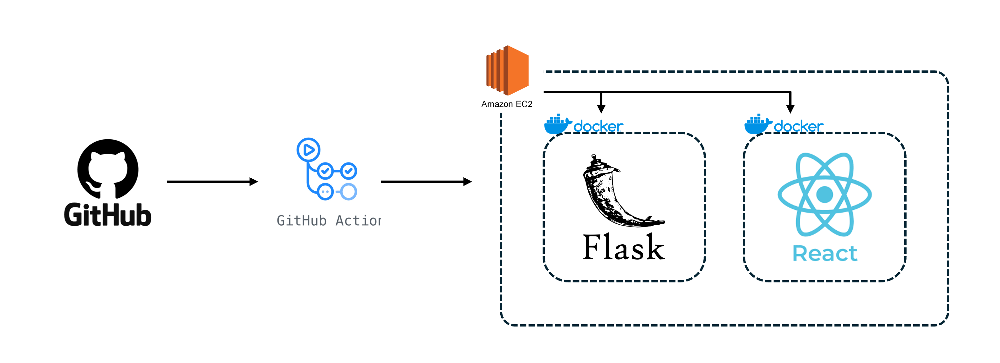

# SaeSPA(요약 퍼스널 아바타)

- SaeSAC Summarization Personal Avatar

# 1. 프로젝트 정보

## 1.1 프로젝트 소개 및 서비스 소개

### 1.1.1 프로젝트 소개



- 우리의 대학생 시절이 기억나시나요? 어제 일처럼 생생하실꺼에요 :D
- 올해 대학에 입학한 새내기 김새싹씨가 있어요.
- 요즘은 교수님들이 교재보다는 PDF 또는 이미지 등 많은 파일을 올려주셔서 많이 다운로드 받아야 해요
- 코로나 지나고 긴 강의를 들으니, 집중이 안돼서 녹음하고, 강의하시는 내용을 사진으로도 찍고, 많은 사이버 강의도 있어서 많은 자료를 봐야하는데요.
  > `이 많은 자료를 요약할 수 있는게 없을까?!` 해서 해당 프로젝트를 진행하게 되었습니다 :D

### 1.1.2 서비스 소개



## 1.2 프로젝트 목표

### 1.2.1 개발

- 기능 중심 프로토타입 개발을 목표로 한다.

### 1.2.2 확장

- 사용자 검증을 통한 사용자 니즈 파악한다.
- 사용자 피드백 기반 확장성을 고민한다.

### 1.2.3 향상

- API 사용을 통한 AI 활용 능력 향상.
- Hugging Face 등 다양한 모델을 비교 및 활용.

## 1.3 팀원 구성 및 담당 작업


- [황지의](https://github.com/jieui)
- [주미현(팀장)](https://github.com/jjoy-joooo)
- [백혜리](https://github.com/hundredTweety)
- [이예림](https://github.com/ppyeohaejangguk)

## 1.4 일정

- 주제 회의: 24.03.06
- 모델 조사 및 테스트: 24.03.07 ~ 24.03.11
- 기능 개발: 24.03.11 ~ 24.03.12
- 모듈화: 24.03.13
- 웹 및 기능 통합: 24.03.14 ~ 24.03.17

# 2. 개발

## 2.1 기술 스택

- Python 3.8
- virtual environment: Miniconda
- Framework: Flask
- IDE: Visual Studio Code

## 2.2 시스템 아키텍처



## 2.3 폴더 구조

- 폴더 구조 설명에 앞서 Frontend와 Backend Repository는 분리되어 작업되었습니다.
  - 이유: AI 관련 백엔드 개발에 초점을 맞춰서 작업되었습니다.

```
├─.github
│  └─workflows
├─app
│  ├─api
│  ├─services
│  │  └─ffmpeg
│  └─utilities
├─readme
│  └─image
└─test_work
    ├─gpt
    ├─pdf
    ├─picture
    ├─video
    │  ├─ffmpeg
    │  └─videos
    └─voice
```

# 3. 실행 방법
1. 도커 이미지 빌드
```shell
docker build -t saespa-api .
```
2. 도커 컨테이너 실행
```shell
docker container -d -p 5000:5000 --name container-saespa-api
```
